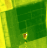
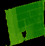

<!-- ABOUT THE PROJECT -->
## About The Project

This project detects and extracts polygons from a NDVI satellite image of an agricultural parcel.

The project is meant to be a component of a dashboard that helps farmers visually analyze and organize their parcels.
In short, the algorithm receives a satellite image of the parcel with a NDVI filter applied, and returns a json/jsonld file with information about
the sub-polygons present in the parcel.

Algorithm pipeline:

1. Image Retreival
- The application is built with Flask, so the coordinates of the parcel are received in the body of the request.
- The satellite image is retreived from the open-source [Terrascope](https://terrascope.be/en) service.
- The chosen image is the most recent one with a clarity > 50% (Less than 50% of the image is covered by clouds).
<p align="center">
  <a>
    
  </a>
</p>


2. Image Processing
- The image is cropped and rescaled, such that only the relevant parcel is visible.
<p align="center">
  <a>
    
  </a>
</p>

- The parcel image is split into 3 images, according to the 3 colors that differentiate the sub-polygons.

<p align="center">
  <a>
    
  </a>
  <a>
    
  </a>
  <a>
    
  </a>
</p>


### Built With

* [Python](https://www.python.org/)
* [Flask](https://palletsprojects.com/p/flask/)
* [JSON](https://www.json.org/json-en.html)


<!-- GETTING STARTED -->
## Getting Started


### Prerequisites

The script is written in Python 3.8.10, which can be downloaded [here](https://www.python.org/downloads/).
The latest releases of Python also include the Python package installer (pip) which is required to install the
following libraries:

* numpy
* math
* requests
* flask
* flask-restful
* flask-apispec
* json
* opencv-python
* uuid
* Pillow
* pandas
* pyproj
* datetime
* random
* shapely

To install the aforementioned packages, the following command should be run in a PowerShell terminal:

  ```sh
  pip install library_name
  ```

### Installation

### Endpoints

### Usage

### 


