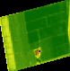
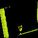
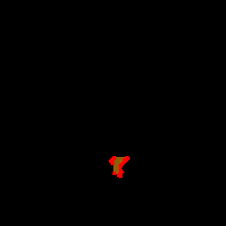

<!-- ABOUT THE PROJECT -->
## NDVI Image Classification and Polygon Detection for Agricultural Parcels

<br/>

### About the Project


In short, the algorithm receives a satellite image of the parcel with a NDVI filter applied, and returns a JSON/JSONLD file with information about
the sub-polygons present in the parcel.
The project is meant to be a component of a dashboard that helps farmers visually analyze and organize their parcels.

<br />
Algorithm pipeline:

1. Image Retrieval
- The application is built with Flask, so the coordinates of the parcel are received in the body of the request.
- The satellite image is retrieved from the open-source [Terrascope](https://terrascope.be/en) service.
- The chosen image is the clearest picture taken by the satellite recently with a clarity > 50% (Less than 50% of the image is covered by clouds).
<p align="center">
  <a>
    
  </a>
</p>


2. Image Processing
- The image is cropped and rescaled, such that only the relevant parcel is visible, not the whole bounding box.
<p align="center">
  <a>
    
  </a>
</p>

- The parcel image is split into 3 images, according to the 3 NDVI colors that differentiate the sub-polygons.

<p align="center">
  <a>
    
  </a>
  <a>
    
  </a>
  <a>
    
  </a>
</p>


3. Polygon Detection
- A polygon is determined by the coordinates of its corners, so it is important to find a way to detect those corners and group them in a coordinate list.
- The corners and contours of each of the 3 images is found by using the [OpenCV](https://opencv.org/) library. Here is a representation of the corners of each image:
<p align="center">
  <a>
    
  </a>
  <a>
    
  </a>
  <a>
    
  </a>
</p>

- The resulting corners all appear in the same list, so in order to find individual polygons we have to group the corners that appear in the same contour.
- The corners are converted from pixel coordinates to latitude and longitude in EPSG 4326 format.


4. JSON(LD) Output
- The color (classnr), area and coordinates are saved for each polygon under different names depending on the desired output.
- For simple JSON, the fields are structured in "Features" that have a class number, area and a polygon geometry which is determined by its coordinates.
- For JSONLD, the fields are organized in Management Zones which also have a class number, area and a Management Zone Geometry. The difference here however, is that the Management Zone Geometry is linked by id to the Management Zone that it belongs to. 


### Built With

* [Python](https://www.python.org/)
* [Flask](https://palletsprojects.com/p/flask/)
* [JSON](https://www.json.org/json-en.html)


<!-- GETTING STARTED -->
## Getting Started


### Prerequisites

The script is written in Python 3.8.10, which can be downloaded [here](https://www.python.org/downloads/).
The latest releases of Python also include the Python package installer (pip) which is required to install the
following libraries:

* numpy
* requests
* flask
* flask-RESTful
* flask-restx
* opencv-python
* uuid
* Pillow
* pyproj

The aforementioned packages and their version are included in the file [requirements.txt](requirements.txt). They can all be installed by typing the following command in a PowerShell terminal:

  ```sh
  pip install -r requirements.txt
  ```

### Usage

The app is written with Flask and it features two endpoints that only differ in the format of the output: one for JSON and one for JSONLD. For more information about the nature of the endpoints run the application and access the [Swagger documentation](http://127.0.0.1:5000/).
Here you can find an example of a body you can use in the POST request.
This body is also provided below:  
{
"polygonCoordinates":"27.199243,45.910026,27.209468,45.911885,27.209607,45.906525,27.200563,45.904793",  
"clientId":"36aef768-3076-43ad-8566-4818fd82c73c"  
}


